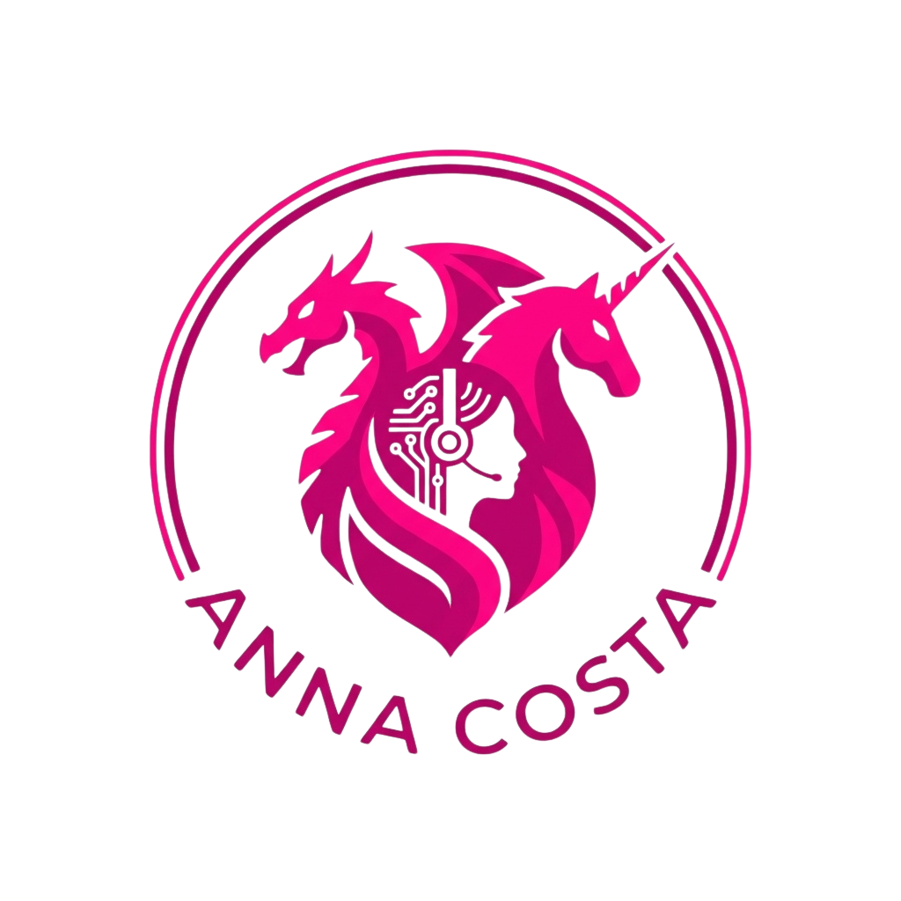

<table width="100%">
  <thead>
    <tr>
      <th width="100%" align="left">
         
        Hi, I'm Anna 😎
      </th>
      <th align="right">
        
      </th>
    </tr>
  </thead>
</table>

🎓 **Proactive Learner with a Passion for Growth**

I am a Junior Full Stack Developer with a solid foundation in web technologies like HTML5, CSS3, and JavaScript, complemented by experience with frameworks such as React and Node.js. My backend expertise includes TypeScript and Python, alongside database management using MySQL and MongoDB.

🚀 **Skills That Drive Results**

I specialize in crafting intuitive, efficient user interfaces and solving technical challenges through innovative solutions. My commitment to continuous learning—reflected in my completion of bootcamps and self-driven projects—ensures that I stay updated with the latest industry trends and tools.

💬 **Building Connections Through Knowledge**

I actively share my learning journey and experiences, sparking conversations and fostering meaningful connections. Whether through my coding projects or data analysis insights, I aim to contribute value to collaborative, dynamic teams.

<strong>Let’s connect and create impactful solutions together!</strong>

Currently, I'm a Community Team Member 🙍🏽‍♂️ [@annahico](https://github.com/annahico).

---

## Languages and Tools:

## 📈 My GitHub Stats:

  

